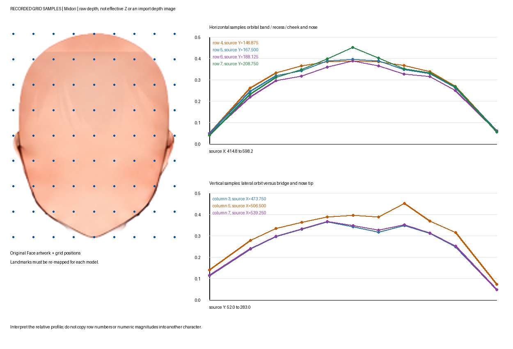

# Midori：顔の深度と参照の読み方

これは元絵から造形を考えるための実例。ユーザー修正前後の差分表や自動適用プリセットではない。ユーザーが調整した時点の深度を記録しているが、全121点やモデル全体を「承認済みの正解」とは扱わない。別モデルではランドマーク、投影、深度倍率を再計測する。

## 先に見る資料

- [元の顔レイヤー](samples/midori-face/face-original.png)、[目・鼻・口を含む元絵の切り出し](samples/midori-face/face-context.png)（元絵座標 x=410..610、y=60..275）
- [説明付き深度データ](samples/midori-face/depth-sample.json)、[全121点のCSV](samples/midori-face/depth-samples.csv)、[保存時のGrid読み戻し原本](samples/midori-face/face-grid-snapshot.json)
- [8方向の一覧](samples/midori-face/directional-references.png)、[方向別の原寸画像・利用範囲](samples/midori-face/directional-reference-index.json)
- [出自とSHA256](samples/midori-face/provenance.json)

JSON/CSVは実際に保存されていたGridの数値。図はその数値を描いた断面グラフで、新しい深度マップ画像ではない。配列は11×11、行優先、0始まり。source座標はlocal座標へ[507,167]を加えたもの。保存depthを絶対Zや白黒画像の輝度として流用しない。

## 数値から読む造形

| 比較箇所 | この例の保存depth | 読む関係 |
|---|---:|---|
| 左側の眼窩上側 r4c3 → くぼみ側 r6c3 → 下側 r7c3 | 0.36445 → 0.31638 → 0.34632 | 滑らかでも平面ではない。上縁と頬側の間にくぼみがある。 |
| 反対側 r4c7 → r6c7 → r7c7 | 0.36600 → 0.32532 → 0.35090 | 非対称を保ち、片側の数値をそのまま反転しない。 |
| 中央の鼻梁寄り r6c5 → 鼻先寄り r7c5 | 0.38700 → 0.45084 | 鼻梁と鼻先の突出を分け、鼻全体を同じ前面へ押し出さない。 |

領域名は元絵との対応から読むための説明であり、各サンプルが解剖学上の点を厳密に測定したものではない。大きな目のイラストでも眼窩のくぼみは必要になり得る。逆に、上の差を大きくすれば正しいわけではない。斜めの参照で、目の横の凹凸・頬の厚み・鼻先の突出が過剰になっていないか確認する。

## 参照画像を使う順序

1. 元の顔でランドマークを対応付け、断面から前後関係を読む。
2. 8方向の同じ参照で、奥側の頬の回り込みと鼻・目・顎の位置関係を確認する。生成画像の髪の描き足し、フリル、花弁、細かなハイライト、口サイズ等は方向別indexの除外域に従う。
3. 深度が成立したら、手前側の目の横〜頬〜顎の輪郭を[Part手順](../../nijigenerate-post-rig-adjustment/references/face-contour-from-reference.md)で合わせる。断面の一致だけでは輪郭・首・髪の接続は完成しない。
4. この画像集に完成リグの合格画像は含めない。現在の対象で新たに同じ姿勢を撮影し、保護状態と見た目を検証する。

## 補助資料：この作業での素材生成失敗（汎用的な編集見本ではない）

| パーツ | 元レイヤー | 不採用の細くした候補 |
|---|---|---|
| hair_side_R | [元画像](samples/midori-face/hair-original-R.png) | [不採用](samples/midori-face/hair-rejected-narrow-R.png) |
| hair_side_L | [元画像](samples/midori-face/hair-original-L.png) | [不採用](samples/midori-face/hair-rejected-narrow-L.png) |

不採用候補は、主毛束の幅と頬への張り出しまで減らし、元の重なりを失わせた。元画像側にも奥の毛束の混入があるため、元画像をそのまま完成例とはしない。一般化するのは[頬の造形と遮蔽の検証](../../nijigenerate-shared-rigging-rules/references/face-visibility-review.md)であり、この素材の削除方法ではない。誤生成した素材が頬を隠して正しい描画・評価を妨げていないかを確認し、確認できた欠陥だけを所有箇所で修正する。後続の生成候補は承認が確認できないため、正解例として収録しない。
