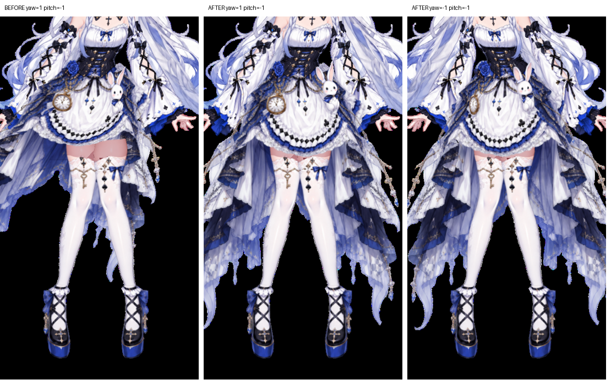
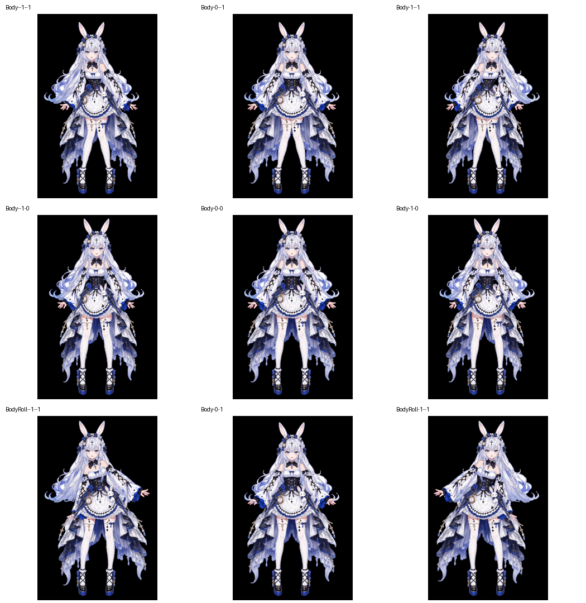
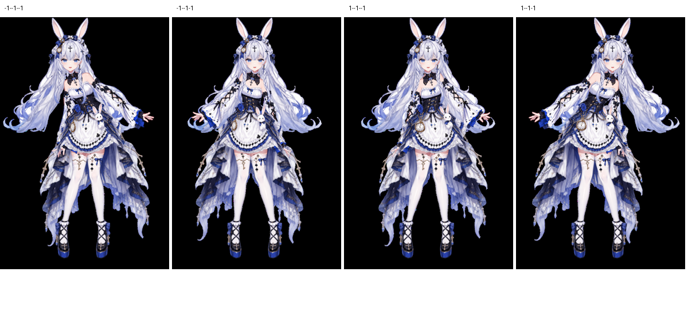

# Ao: Body yawを伝え、上半身Pitchからスカートを分離する実例

## 資料の範囲

2026-09-22の修正記録から抽出した実例。現行モデルの完成証明、ユーザーの外観承認、他モデル向けのプリセットではない。以後にも腰の接合・深度などの修正が行われている。この資料を使って過去モデルをロードしたり、現在の設定を上書きしたりしない。

- 一般手順：[pelvis-skirt-follow.md](pelvis-skirt-follow.md)
- 実測設定・検査値：[ao-skirt-follow.json](examples/ao-skirt-follow.json)
- 出自と収録ファイルのハッシュ：[example-provenance.json](example-provenance.json)

資料は読取り用であり、実行用のnjcペイロードではない。ローカルパス、接続URI、保存先、実モデルのUUIDを除き、ノード名による対応に置き換えている。適用時は現モデルのUUIDと現在のコマンドスキーマを解決する。

## 要求と失敗の原因

要求は「下半身の衣装として腰に付着し、体の左右回転・腰の上下移動には追従するが、上半身の前後傾ではスカート全体を板のように傾けない」。対象は前後スカート、エプロン、左右側面、左右の長い裾、付属ぬいぐるみだった。

Spine配下では上半身Pitch/Rollを継承してしまった。一方、Pelvisへ親を移すだけでは、BodyのYawでPelvis自身が回転しない構成にYawを追加できない。さらに、YawしないPelvisとYawするスカートボーンを同じ面のBoneSourceとして混ぜると、見た目の回転が弱くなった。親階層、パラメータの駆動、BoneSourceの三つを別々に確認する必要があった。

## 記録された構成

```text
Pelvis                         腰の移動とPelvis自身のRoll
└─ Skirt.PelvisYaw              BodyのYawを明示的に駆動
   ├─ Skirt.Front               前面の腰接点
   │  └─ Skirt.Front.Hem        前側の裾
   └─ Skirt.Back                背面の腰接点
      └─ Skirt.Back.Hem         後側の裾
```

前後ボーンは既存の異なる深度面に置き、中立のワールド位置を保って親を変更した。`Skirt.PelvisYaw`に上半身SpineのPitch/Rollを継承させず、Pelvis側の移動は階層から受ける。

実際の駆動は **`Body::Yaw-Pitch` → `Skirt.PelvisYaw.transform.r.y`への直接Binding**。別パラメータを介するParameterLinkではなかった。記録上、XがYaw、YがPitchで、Pitch=-1が前傾、+1が後傾。角度はrad単位で、既存SpineのYawと同じ符号・量を使っていた。

| Body X（Yaw） | 全Pitchキーでの`transform.r.y` |
|---|---:|
| -1 | -0.5235988 |
| -0.5 | -0.2617994 |
| 0 | 0 |
| 0.5 | 0.2617994 |
| 1 | 0.5235988 |

Pitchキーも`[-1, -0.5, 0, 0.5, 1]`。25セルすべてを設定し、同じYawではPitchが変わっても同じ回転値にした。これは独立したスカート起点のYawについての性質であり、腰の接合帯に必要な変形を一切禁止するものではない。±30度、キー数、符号、ボーン名はAoの当時の設定であり一般値ではない。

## BoneSourceと重複追従

当時の8衣装Gridでは、直接のPelvisソースの重みを2から0へ変更し、Pelvisの移動を階層から受けた。前後のスカートソースは対応する面に残した。**他モデルのPelvis重みを一律0にしてはならない。** 腰の接合帯の連続性を含め、各ソースが実際に与える運動を確かめて判断する。

修正途中でソースの`depthScale/depthOffset`を一律1/0へ戻した試行は、側面の裾に折返しを生じさせた。最終記録では従来のソース深度設定を維持した。Yawの伝達修正を理由に、受け入れ済みの深度応答を既定値へ戻さない。

`Plush::G`は骨のPitch誤差が0でも、祖先Part/Gridから追加の変形を受けていた。Gridを既存の`body`配下へ移し、子集合・中立位置・メッシュ・深度・実効描画順を維持して重複追従を除いた。これは問題のあった階層だけの処置であり、衣装を一括で再配置する手順ではない。骨の変更後に生じる生成済みGridの変形差分は、手で輪郭補正した差分と分けて記録する。

## 比較画像と証拠の限界



左は修正前のYaw=1/Pitch=-1、中央は同じ値の修正後、右は修正後のYaw=-1/Pitch=-1。裾の横への飛び出し、腰・エプロン・後裾のつながりを比較する資料。右は反対方向の検査であり、左と同じ姿勢の比較ではない。



上段はBodyのYaw=-1/0/1、Pitch=-1。中段はYaw=-1/0/1、Pitch=0。下段中央はBody=(0,1)、下段左右は画像ラベルのBodyRoll値。画像に記載のない他パラメータ値やカメラ条件を推測して完全な再現記録とは扱わない。



左からBody=(-1,-1)/Roll=(-1,-1)、Body=(-1,-1)/Roll=(1,-1)、Body=(1,-1)/Roll=(-1,-1)、Body=(1,-1)/Roll=(1,-1)。この資料には袖の既知の折返しも含まれ、全身合格の例ではない。

監査原本は中立の同一カメラで最大画素差0、25姿勢の骨検査、前後傾・左右回転、Face単独とBody/Roll複合検査を記録していた。ただし、衣装Gridの描画結果にはPelvisの平行移動との差が残り、複合姿勢では袖に負面積のセルも記録されていた。抜粋JSONにその値を残した。骨のPitch流入が0であること、衣装の画面上の形状、全身の品質は別の判定である。

現在の作業では、Body→起点の駆動、面ごとのBoneSource、祖先の重複追従、腰の連続性を順に検査し、反対方向・中間値・複合姿勢を再取得する。当時の`VERIFIED_SKIRT_SCOPE`という監査ラベルを現在の合格判定として流用しない。
