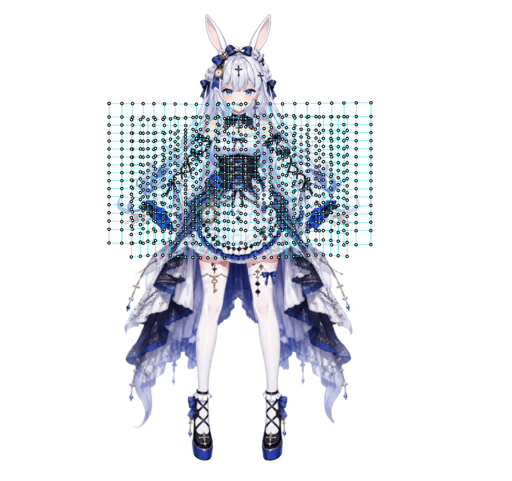
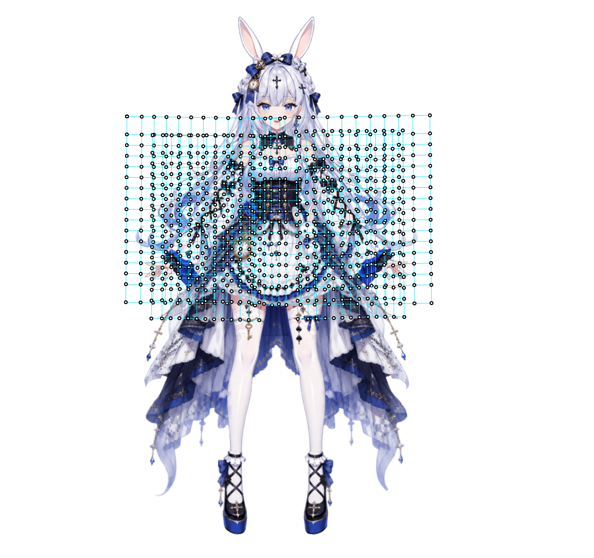

# 腕：前傾追従を保ち、後傾時は下へ垂らす

## 担当と基準

体に付いた腕の姿勢はDepthBone/BoneSourceで扱う。後傾に対する腕の垂れを、腕・袖Partの広域変形や物理だけで作らない。正しい骨運動の後に残る肩・脇・袖の輪郭や接触だけを個別Partの担当へ渡す。後ろ髪と似た垂れ方の要求でも、髪の骨・角度・重みを腕へコピーしない。

前傾時の体への追従、中立、肩の接点、骨長、肘・手首の連続を保護する。肩を固定するとは、肩の画面座標を全姿勢で固定することではなく、現在の胸郭・鎖骨との接続を保つこと。後傾側だけを修正する要求を、前傾や左右回転を強める指示に読み替えない。

## 操作手順

1. 現在のBody軸・符号、左右の骨軸とrestRoll、親階層、Clavicle→UpperArm→Forearm→Hand、腕・袖・手のBoneSources、既存の直接BindingとParameterLinkを読む。正面だけでなく左右Yawで、肩から手首へどの回転が伝わるかを確かめる。一般名から軸の向きや符号を決めない。
2. 中立、前傾、後傾、両Yaw端、途中値と関連Rollを保存する。肩・肘・手首を同じ絵の位置から測る。3DではBodyのYawで回った腕の座標系と世界の下方向を区別する。画像では肩を原点O、肩線をT、下向き法線をNとする局所値に加え、同一カメラでの絶対位置も保存する。肩線の法線はRoll時の世界重力と同じとは限らない。
3. 後傾したChest/Spineの回転を腕が過度に引き継ぐ場合、肩の付着を保ったまま必要な反対向き回転を担当骨へ与える。Aoでは左右Clavicleの軸回転を使い、既存の腕全鎖を動かした。別モデルでも同じ骨・同じ軸が適切とは限らない。左右の軸向きが逆なら補正符号も別に判断する。
4. 必要な骨プロパティに、現在のnjcスキーマで後傾補正を設定する。既存Bodyからの直接Bindingで十分なら別パラメータを増やさない。専用パラメータを使う設計ならBodyからのリンクと重複駆動の有無を明記する。既存値へ加える補正量と、最終プロパティ値を混同しない。
5. 中立を「追加補正量0」の境界として明示し、後傾の端点だけでなく中間キーも設定する。受け入れ済みの非ゼロ中立値を0へ上書きしてはならない。前傾側の既存キーとset/unset状態は維持する。後傾の補間が前傾へ流れないことを実表示で検証する。数値0でも未設定なら明示境界とは限らない。
6. 全Yaw列で肩・肘・手首を評価する。手首が下がった量だけで判断せず、肘の曲がり、上腕・前腕・手のつながり、肩と胴体、袖のひだ、脇の空間を同時に見る。腕・袖のメッシュ反転や折返しも確認する。
7. 骨の読戻しと生成済みGrid変形の更新を分けて監査する。深度、メッシュ、rest座標、階層、BoneSource、既存キーを依頼外で作り直さない。ネイティブ再計算による対象外差分も差分として扱い、肩相対の一致だけで全体不変を宣言しない。[パラメータ状態の分離](../../nijigenerate-shared-rigging-rules/references/parameter-state-isolation.md)に従う。
8. 前傾・中立の相対姿勢と絶対位置、後傾の下がり方、左右・途中値・Roll複合を別々に判定する。未確認の複合姿勢や残った差分は明記する。既存の履歴で保存されたことは、現在の回帰検査を省略する根拠にならない。

## Aoの記録された実装

[匿名化したBinding・姿勢測定・差分記録](examples/ao-arm-backward-hang.json)、[出自とハッシュ](example-provenance.json)を参照する。読み取り用の履歴であり、実行用ペイロードや既定角度ではない。UUIDと操作スキーマは現モデルから解決する。

- Body X=Yaw、Y=Pitch、Y負=前傾、正=後傾。Lは中立で画面右、Rは画面左。
- 実装は`Body::Yaw-Pitch`から`Clavicle.L/R`の`transform.r.y`への直接Binding。腕専用パラメータ案は、この適用結果では使用していない。
- 各Yaw列で以下の同じ値を設定した。元のBodyの後傾を腕側で弱めるためのAo固有の角度であり、別モデルのClavicleへ無条件に適用しない。

| Body Pitch | Lの回転値（rad） | Rの回転値（rad） | 両BindingのisSet |
|---|---:|---:|---|
| -1 | 0 | 0 | false |
| -0.5 | 0 | 0 | false |
| 0 | 0 | 0 | true |
| 0.5 | 0.19198622（約11°） | -0.19198622 | true |
| 1 | 0.38397244（約22°） | -0.38397244 | true |

Yawは`[-1,-0.5,0,0.5,1]`。各Bindingで15セルを明示し、前傾10セルは未設定。25セルをすべて設定した例ではない。未設定側の挙動は、全25姿勢の描画で別途検査した。

## 当時の比較画像と限界

Body=(0,1)の変更前。腕・袖Gridのオーバーレイを含む。

同じBody値の変更後。

画像は当時の検査資料であり、全身の完成例ではない。見える胴体・衣装の差を腕の改善と取り違えない。ボーンは変更してもGridの線が動くのは生成された腕・袖変形の結果であり、親Gridを手で輪郭補正した証拠ではない。

原本は後傾端で手首が肩相対で約27.971〜32.506px、中間後傾で約7.111〜9.241px下がり、Body全25姿勢の腕・袖4Gridに反転セルがなかったと記録する。

一方、前傾の肩相対手首差は最大約0.0252pxだったが、腕・袖Gridの**絶対位置差は最大約5.0940px**残った。全静的ノード・深度・メッシュ・階層・BoneSourceが同じでも、生成済みBody/FaceRoll/BodyRollのキャッシュは同一ではなかった。数値の意味と単位を分け、これを完全不変の成功例とは扱わない。

当時は再読み込み禁止と現状保持の指示により、追加の復旧を行わず差分を記録して保存した。その個別判断は、別の作業で副作用を許容する一般規則ではない。再読み込み、Undo、標準リグの再生成を暗黙の復旧手順として追加しない。
