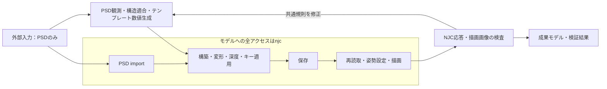

# INXとモデルの操作経路

外部キャラクター入力はPSD一つ。INX/INPおよびアプリ内モデルへの全操作は、`njc`実行ファイルを起動して行う。読み取りも例外ではない。

| 処理 | 許される実装 |
|---|---|
| PSDの画素・alpha・階層の採取 | PythonのPSD処理 |
| 構造推定・数値適合・テンプレート計算 | 決定論的な共通Pythonコード |
| PSDをモデルへimport | `njc tools call FileCommand_ImportPSD` |
| 内部INXを開く・別名保存 | `njc tools call FileCommand_OpenFile` / `FileCommand_SaveFile` |
| node・mesh・深度・parameter・bindingの作成と編集 | `njc tools call` |
| モデル状態・構造・キー値の読取 | `njc find` / `read` / `resources read` |
| 保存後の再読取・検証姿勢・描画 | `njc`でopen・状態取得・姿勢設定・画像出力。数値集計と画像比較はPython |

INX/INPのバイナリ/JSON直接解析、Python・シェルによるコピー/置換/書込、HTTP/MCP直呼び、GUI操作での代替を禁止する。エラー、速度、大容量、検証、復旧を理由に境界を迂回しない。複製が必要なら`njc`で対象を開いて同一性を照合し、`njc`で別名保存する。

## 実装による強制

- `riglib/live.py`が唯一のモデル通信口。シェルを使わず引数配列で`njc`を起動する。直接HTTP fallbackはない。
- `riglib/model.py`はNJC応答の正規化だけを行う。`client`必須。ファイルpathを渡してモデルを読む旧APIは拒否する。内部の純粋normalizerはモデルファイルを開かない。
- `riglib/data.py`の汎用JSON読取・書込・ファイルhashも`.inx/.inp`を拒否する。
- `build_native.py`は元INXをコピーしない。NJCでopenした状態の指紋がprogramのNJC観測と一致するまで、別名保存・骨生成を始めない。旧ファイル解析由来のprogramは再観測を要求する。
- `inspect-model`、`assemble-model`、`infer-structure`は`--model`を受けず、`--njc`で現在の作業モデルを観測する。これはPSDから内部生成したモデルに使う開発用入口である。
- `verify_njc_boundary.py`で経路を静的監査する。検査の成功は任意の将来コードや外部プロセスを隔離するOSの保証ではなく、対象コードの境界検査である。

## 現行NJCで確認した制約

現行CLIのJSON受付はliteralの`--json`のみ。標準入力・response file・JSON fileの受付はない。引用とUTF-16符号単位を含むコマンドライン長を起動前に検査し、保守上限30000を超えれば送信せず失敗する。NJC側に正式な大容量入力が追加されるまでは、HTTP直送で補わない。各命令の事前検査は一括処理全体のtransactionを意味しない。途中失敗時はNJCで実状態を読み、未適用箇所を特定する。

JSONで整数値を表す浮動小数の`.0`を省くことは、値を変えない文字列表現の短縮として行う。
幾何の丸めはtransport内で黙って行わず、compilerが誤差条件を満たす値を生成し、
その最終値を再検査する。引数上限・通信経路・一括要求を分割しない制約は変えない。

公開node resourceは部分serializationであり、INX全内容ではない。公開Parameter resourceは完全な設定を返さないため、完全情報を要求する観測は不足時に拒否する。nodeだけの検査は取得範囲を明記する。Binding descriptorから取得できる軸値・キー配列は別途検査できるが、未公開parameter設定を推測しない。

状態hashはNJC公開応答を正規化した内容に対するhashであり、INXファイル全体のhashではない。二回同じ内容を取得できても、原子的snapshotやファイル保存の完全一致を証明したことにはならない。open成功応答だけで復旧ダイアログ等の完了を仮定せず、対象UUID・構造・取得可能な値を照合する。照合できない場合にファイルの直接読取へ逃げない。

## フロー

これは必須の経路設計であり、PSDから完成リグまでの全工程が接続済みという宣言ではない。
