# PSDだけを外部入力とする契約

キャラクターごとに外から受け取る資料はPSD一つ。基準点、分類表、別の原画、INX、深度画像、寸法、姿勢表を別途求めない。ユーザーによる所定のレイヤー名への付替えや、メタデータへの手動基準点の埋込も要求しない。

出力先、Python/NJCの場所は実行環境であり、キャラクターの形状や対応を入力する経路に使わない。同梱テンプレート、人体prior、既定の駆動範囲、検証姿勢は版管理する共通プログラム資源。モデル専用の外部overrideは受け取らない。

モデル操作は読取・import・複製・構築・変更・保存・検査・描画のすべてを`njc`経由にする。PythonでINXを解析・コピーする工程やHTTP直呼びは置かない。以下のNJC枠が唯一のモデル接続口である。

## 処理の境界

| 情報 | 出所と生成責任 |
|---|---|
| 合成画像、個別画素、alpha、mask、offset、階層、描画順 | PSDから決定論的に採取 |
| レイヤーの識別 | PSD内のindex path。名前の重複・無名を許す |
| 未リグINX、engine UUID対応 | 同じPSDの正規importと構造照合から内部生成 |
| 意味・支持関係 | PSD由来の形状・配置・重なり・接合候補を全体で比較。曖昧な候補だけ内部エージェント判断 |
| 関節、基準点、frame、厚さ、断面 | 共通計測・適合器と宣言したpriorから内部生成。手製の数値JSONを外から供給しない |
| owner、chart、素材UV、mesh、深度、変形キー | 同梱テンプレートと共通kernelから生成 |
| 動作・可動範囲・検証pose | 同梱の標準方針と推定構造から導出 |
| 保存モデル、画像、検査結果 | 実適用・保存・再読取・実描画の出力 |

内部ファイルであるというだけではPSD由来の証明にならない。PSD hash、抽出レイヤーID、観測に用いた画素領域、候補生成方法、prior/コード版、候補選択を記録する。エージェントが任意の座標・深度配列をJSONへ書き、それを内部生成と呼ぶ経路は採らない。

## 改訂したフロー

次はPSD限定という入力契約のフローである。全矢印が現在のCLIで自動接続されているという意味ではない。

```mermaid
flowchart TD
    P["外部入力：PSD一つ"] --> X["画素・alpha・mask・階層・offsetを抽出"]
    X --> O["全体の形状・配置・接合候補を測定"]
    O --> G["主骨格・共有体積・支持関係の候補を比較"]
    G --> A["意味が曖昧な候補だけ内部エージェントが判断"]
    A --> F["基準点・関節・局所frame・低自由度形状を適合"]
    F --> S["共有面へ素材を登録し深度・mesh・駆動を生成"]
    P --> I
    S --> N
    subgraph J["モデルへの唯一の接続口：njc"]
        I["PSDをimportし作業INXを内部生成"]
        Q["モデル状態をnjcで取得・PSD対応を照合"]
        N["構造・mesh・深度・キーを適用"]
        V["保存・再読取・実描画"]
        I --> Q --> N --> V
    end
    V --> C["njc応答と描画結果を検証"]
    C -->|"修正"| O
    C -->|"検証完了"| R["リグ済みモデルと検証結果"]
    subgraph B["同梱する汎用プログラム資源"]
        T["意味格子・形状テンプレート・人体prior・標準動作"]
    end
    T --> G
    T --> F
    T --> S
```

## 実装済みの入口と残る接続

`scripts/rig.py prepare-psd --psd <source.psd> --out <run-source-directory>` は、別INXや観測JSONを引数に取らず、PSDから内部素材と`psd-source.json`を生成する。名前で素材を一意化しない。背景に依存するclip/blend等を、単独PNGの独立合成で再現できると誤認しない。入力PSDは変更しない。

この入口は入力採取段階であり、完成リグの一括生成ではない。既存の`capture_source.py`は内部生成済みINXとの照合用として残し、新規入力の必須条件にはしない。

現在の`solve_scaffold`は既存の関節観測・体積寸法を必要とする。PSDからそれらを自動生成し、意味候補を全身の拘束へ接続する処理は開発対象であり、外部JSONで穴埋めしてPSDだけで完了したとしない。`template_runtime.py`も主compilerへの統合が必要。数値不足を追加ユーザー入力の要求に変換しない。

既存の低水準CLIには任意pathを読む機能が残る。利用は当該PSDの内部工程・開発検査に限定する。全低水準APIに対する由来検査や、別PSDの中間成果物の混入を拒否する一貫したrun管理は未完成であり、ハッシュを記載しただけで強制済みとは報告しない。
