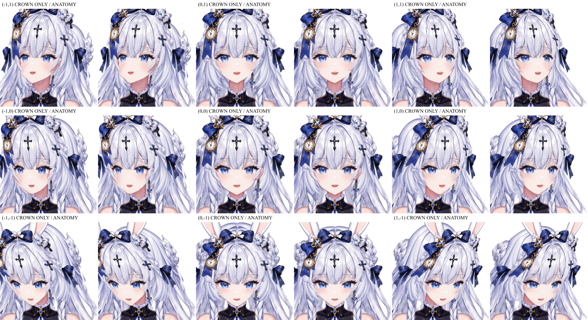
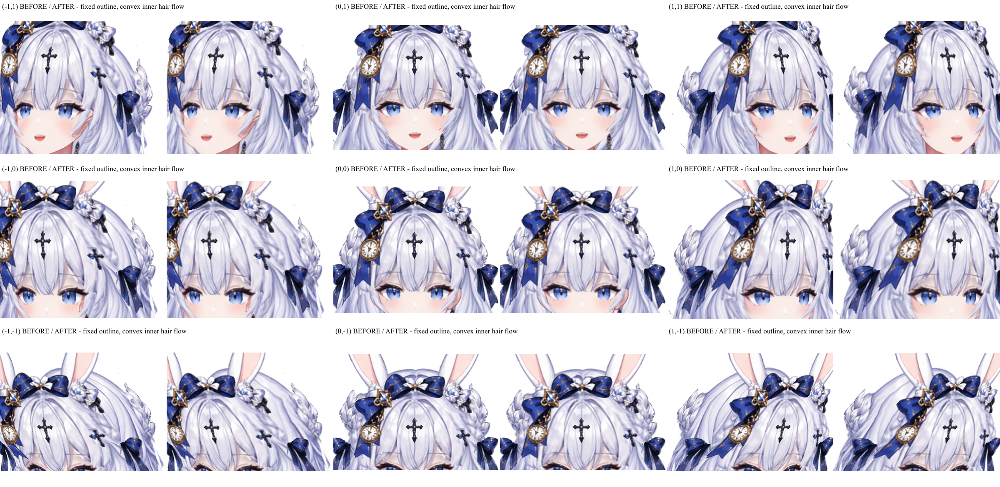
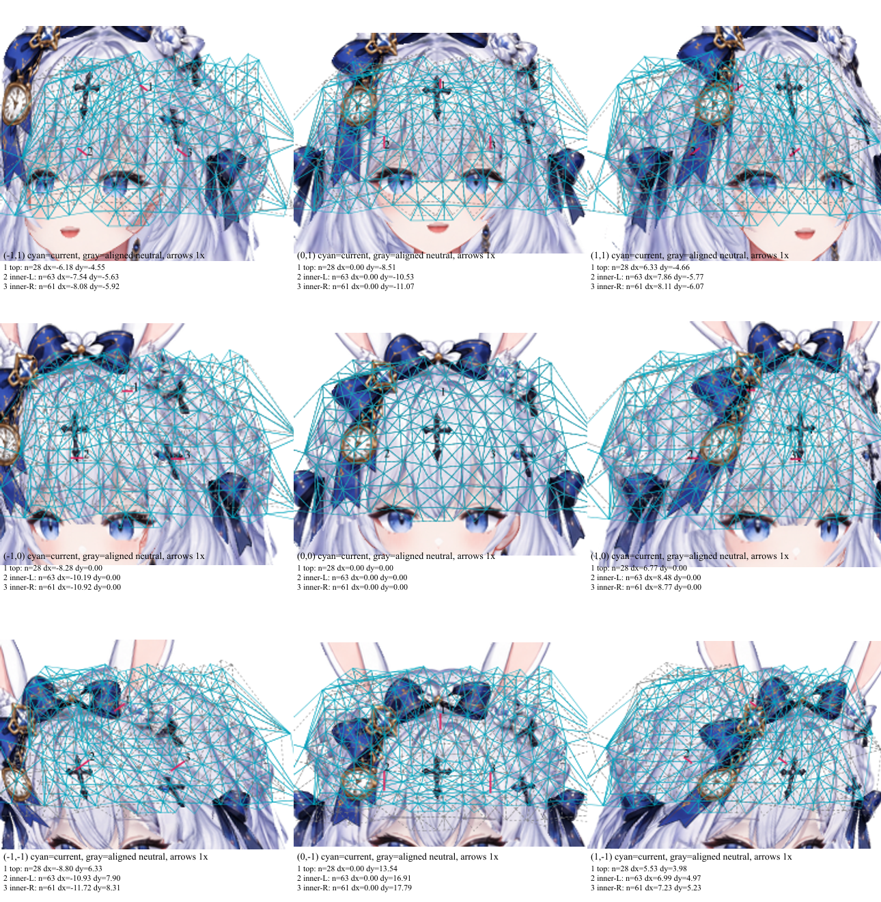
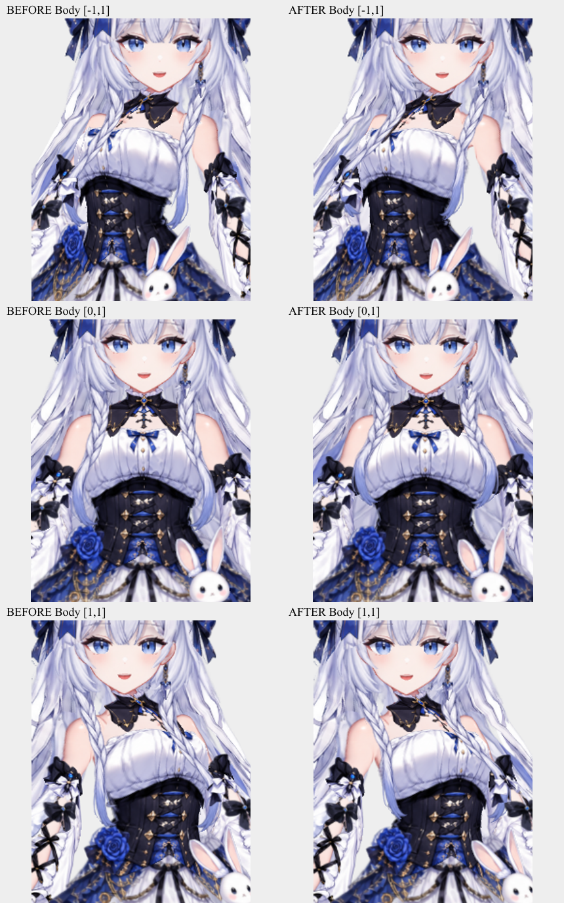

# Ao：後頭部と長髪の参照表・作例

長髪のリグではこの表の全項目を読み、現在のモデルへの適用／不適用理由を記録する。適用すべき処置と、棄却された試行は区別する。全項目の参照は、Aoの数字・レイヤ名・全操作をコピーする指示ではない。一般的な後頭部と髪なしは[共通の分岐](../../nijigenerate-depth-import-adjustment/references/head-volume-and-hair-cases.md)へ。

## 必読の対応表

| Aoで扱った内容 | 引き継ぐ判断・方法 | 所有手順 |
|---|---|---|
| 頭頂と後頭部が別の部品に見える | 前髪・耳後ろ・後ろ髪の同じ頭皮を対応付け、深度整合の後に局所Part残差 | [頭部深度](../../nijigenerate-depth-import-adjustment/references/head-volume-and-hair-cases.md)、[Part](head-hair-surface-correction.md) |
| 参照画像自体の後頭部が不適切 | その領域を棄却。上縁だけを見直し、後頭部中央の厚みと下側毛束を残す | 頭部深度 |
| 外周は正しいが内部模様が奥向き | alpha輪郭と支持三角形を固定し、同姿勢の有効な凸面運動を内部だけの残差に使う | Part |
| 内部の毛流れが角張る | 少数頂点への集中を棄却。必要な領域だけ細分化し、全姿勢の元面・UVを継承 | Partと[メッシュ移行](../../nijigenerate-automesh-setup/references/parameter-only-and-rigged-mesh.md) |
| 耳後ろと長い後ろ髪の混在 | 制御面を分離し、移動後の領域と密度を整え、耳直後の深度・三つ編みとの描画順を個別検査 | [構造](../../nijigenerate-model-setup/SKILL.md)、メッシュ移行、頭部深度 |
| 三つ編みと顔、耳飾りの表示順 | 指摘された組の実際の重なりと実効zSortを確認。別の横髪まで無差別に変更しない | 構造、[個別2.5D](individual-2p5d-and-reference.md) |
| 独立した髪の起点・リンク | 骨で追従を作り、明示的なパラメータリンクを設定。重複した直結変形を確認 | [長髪の追従](../../nijigenerate-depth-skeleton-setup/references/long-hair-follow.md) |
| 顔の向きと前後傾軸の不一致 | Pitchを意図したYawで回った座標系で評価する | 長髪の追従 |
| 頭部から下側への切替 | Head由来の上部とBody由来の下部をBoneSourceで連続的に混ぜる。下部の古いFace Xリンクを外す | 長髪の追従 |
| 横髪と後ろ髪の垂れ方 | ボーンを分離。後ろ髪の前傾は保ち、後傾を下へ。横髪は別に体へ沿わせる | 長髪の追従 |
| 不要なBody Roll追従 | 担当骨のRollを修正し、必要な頭部追従を維持 | 長髪の追従 |
| 三つ編みの後傾追従 | 横髪側の後傾キーを体に沿わせ、Faceと逆向きの姿勢も確認 | 長髪の追従 |
| 揺れ・Length変更 | 姿勢確定後に物理。根元固定、時間を伴う検査、倍率指示の一度だけの適用 | [物理と既存数値作例](../../nijigenerate-simple-physics-rigging/references/time-based-tuning.md) |
| 再計算の副作用 | 対象外のバインディング差を残したまま全体OKにしない。保存と品質承認を分ける | [状態の分離](../../nijigenerate-shared-rigging-rules/references/parameter-state-isolation.md) |

## 記録の読み方

[匿名化した設定・検査記録](examples/ao-head-long-hair-records.json)に、頭皮・後頭部・内部模様・リンク変更・重みの監査例・垂れ方・Roll・三つ編みの記録を収録した。[出自・ハッシュ](ao-head-long-hair-provenance.json)で元資料を識別する。個人のパス、接続URI、UUID、保存先は収録しない。実行可能なnjcペイロードではない。

記録は同時点の完成モデルではない。特に次を区別する。

- 初期の髪パラメータはFace X/Body Yだったが、下側の髪は後にBody X/Body Yへ変更された。名前だけで古い配線へ戻さない。
- 頭部／体の重み監査の表は当時のソース設定から得た監査上の推定値で、画素の追従を直接測った値ではない。実際の描画検査も必要。
- 頭部／体のグラデーション工程には対象外キャッシュの差分が残り、`RETAKE`だった。後の横髪／後ろ髪分離も、その既存問題を解決したとは報告していない。
- 後頭部の一括前方移動、生成参照の後ろ髪形状、内部8頂点だけの補正は棄却された。手順の正例として使わない。
- 三つ編み工程では既存の細い三角形の反転と別件の胴体問題が残っていた。画像を全身完成の例にしない。

## 頭頂の継ぎ目と後頭部の形

各組は画像内の`CROWN ONLY / ANATOMY`の順。前者は頭頂の継ぎ目の段階、後者は参照品質への指摘を受けた後頭部上縁の修正段階。生成画像との比較ではない。Faceの値は組ごとに表示されている。後頭部全体を平らにする代わりに、上縁と中央の厚みを分けている。原本はEarBack側54深度点とBackHair上側15深度点の変更、EarBack Partの残差、下側・顔・首の保持を記録している。

## 外周を保った内部模様

各組は`BEFORE / AFTER`。頭頂の輪郭を保ったまま、上側の内部模様を手前に凸な面として見せる局所補正。深度や骨を再構築した例ではない。

既存の凸面運動を各方向で観察し、内部の支持領域を滑らかにした記録。シアンは当時の表示、グレーは位置合わせした中立。矢印は中立との差であり、すべてが追加したPart残差ではない。原本は207→485頂点、400→952三角形、元頂点保持、中立0、全25キー、複合12姿勢を記録する。頂点数や153点の支持領域はプリセットではない。alpha境界三角形を固定し、新頂点は変更前の各キーの面を継承した。

## 三つ編みの体への追従

BodyのYaw=-1/0/1、Pitch=1の前後比較。前傾・中立を保持したまま、後傾キーの骨運動を修正した工程。頭部と体の重み・リンクは維持した。胸・肩など別件の品質を保証する画像ではない。

髪なしの実例は未収録である。Aoの画像を髪なしの検証済み作例として転用せず、[髪なし手順](../../nijigenerate-depth-import-adjustment/references/head-volume-and-hair-cases.md)に沿って対象モデルの証拠を取得する。
